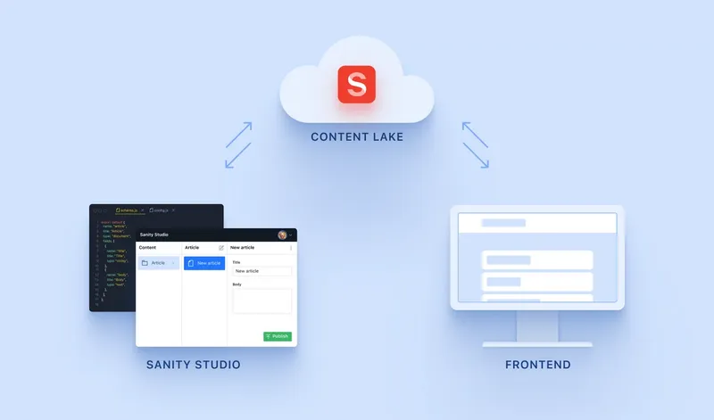
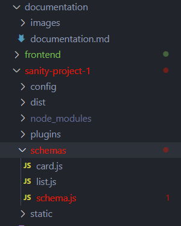
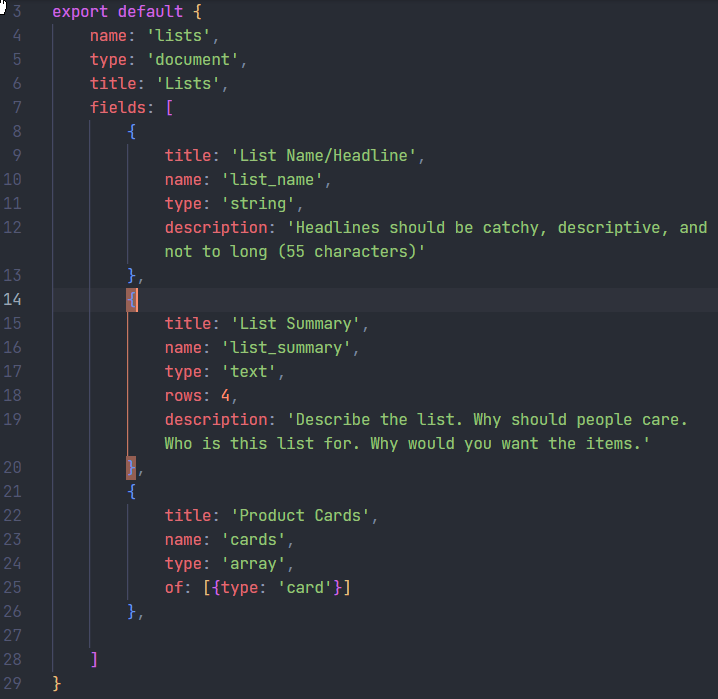
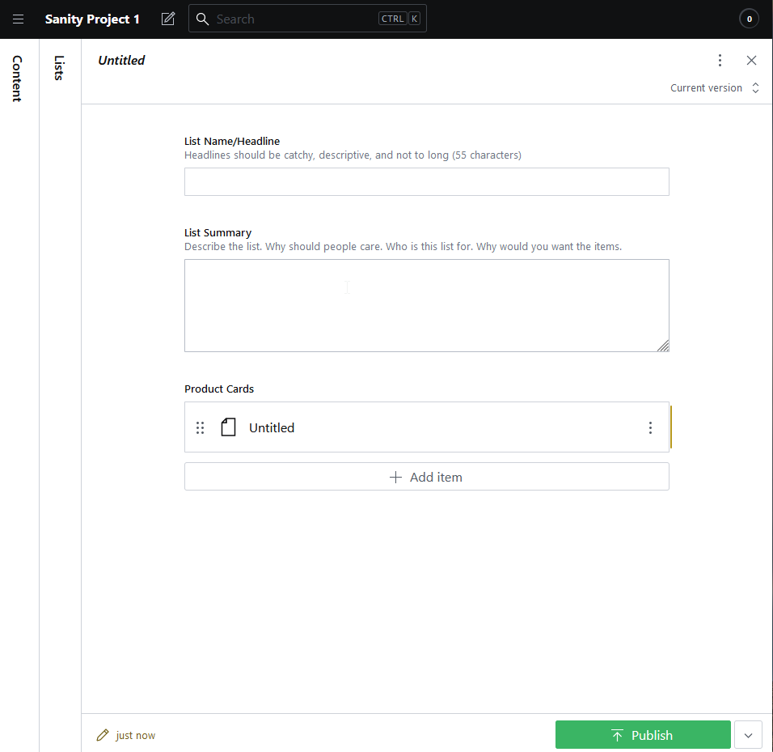
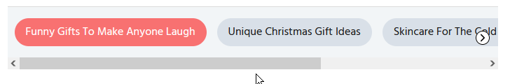
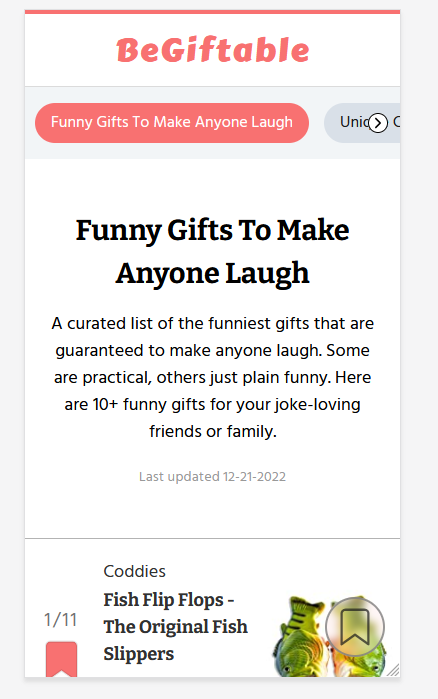
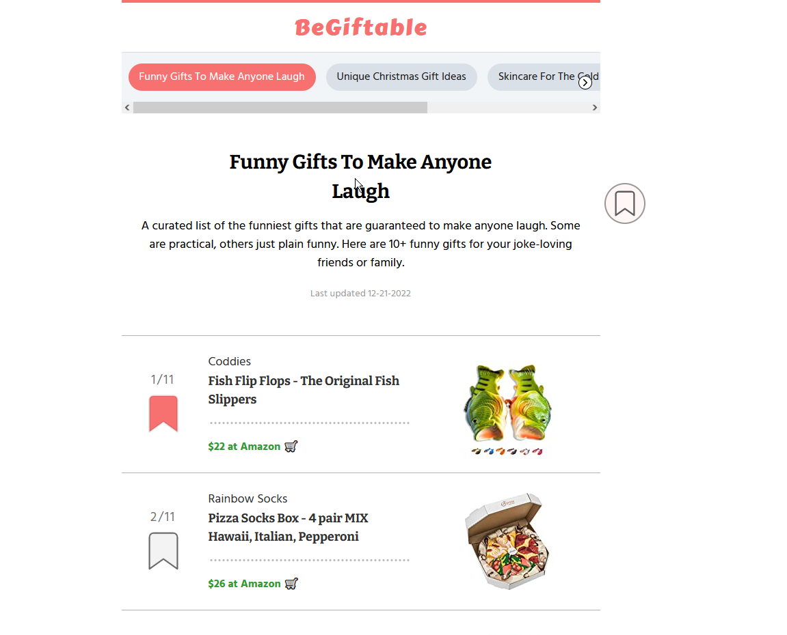
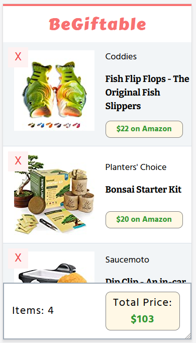

# BeGiftable.com Project
#### Video Demo: https://youtu.be/LFatkuL_ec8
### **TLDR: Short description of every section below:**
Begiftable is a web-app that lets you scroll through curated lists, save your favorite products, and make buying decisions.
 
This project was made with HTML,CSS,JavaScript. I deliberately chose to use no frameworks or libraries because I wanted to create something awesome while improving my core JavaScript skills.
 
I used the BEM(Block__Element--Modifier) methodology for my CSS selectors.
 
The software architecture I used is JAMstack. Javascript, API, Markup.
 
For my JAMstack 'backend' I chose Sanity.io because of its cost to host the CMS backend(free) and the great documentation. I then installed the starter files via npm and coded the schema object, to get the right inputs for the CMS. I wrote content. Sanity.io turned my content into an API I could use.
 
I have a file helper.js that improves the readability of my code and speed of development with two functions.
 
The main features
1. Sticky + Scrollable Categories Bar
    * `position: sticky;` plus being inside the right container to stick to the top
    * `overflow: x; display: flex;` to have elements overflow and inline axis scroll bar
    * Inside this scroll bar where click to scroll arrows. It didn't make sense to display the right scroll arrow, when at the end of the list. To solve this I used the Intersection Observer API.
2. Routing
    * Routing was done with HTML and CSS only using :target pseudo-class. If the list was ":targeted" then it would display: block; to show.
    * Bookmark.html was done as a normal link
3. Responsive Design
    * The website was built mobile first and is responsive so it looks good on desktop too.
4. Bookmark Feature
    * Each card had a bookmark icon you could click to save a product to your own "bookmark list". This feature uses the LocalStorage API.
 
## **Introduction**
Hi, my name is Patrick and the final project I created for CS50 is a website, BeGiftable.com. Here you are able to search our curated lists, bookmark your favorite products, and make buying decisions based on your budget. 
 
This project was made all ‘vanilla’ with no frameworks or libraries. My goal was to improve my core JavaScript skills and make something awesome doing it. Let's first look at the software’s architecture.
 
## **Software Architecture**
In CS50 we learned about MVC or the model-view-controller architecture. This left me curious to what other options there are. After doing my research and seeing different configurations of databases and controller languages, I decided to try a different software architecture called the JAMstack.
 
Javascript, API, Markdown. The JAMstack is unlike a traditional database where you store data and manage it with SQL. Here you have more of a traditional CMS(content management system), where you can create data, that then will be stored in a database as an API that you can use for your frontend.
 

 
I researched and tried multiple JAMstack platforms and ultimately settled on Sanity.io. I chose them because hosting the backend was free and they had excellent documentation.
 
It wasn't completely necessary to host the backend online, as you could use it locally. However I wanted to be able to have a backend where I can invite team members, such as my siblings, and let them create content.
 
## **CSS Methodology**
Since I wasn’t going to install any helpful libraries I needed to find a way to manage my CSS without getting confused.
 
I used the methodology of BEM(Block Element Modifier) to do exactly this. Here's how it works: a selector like `.card__header--active` means the **header** element is in the **card** block and its styles are modified to the **active** styles.
 
This helps stop specificity wars, since most CSS selectors are just a single class. It also makes the CSS much more readable, when you can quickly see how every piece is related.
 
## **Creating a Backend with Sanity.io**
With Sanity.io you start with a blank slate. To create a backend you have to edit schema code.
 

 
Here is my code. A JavaScript object like this, is turned into...
 

 
... a backend that looks like this.
 

 
Now with my custom CMS backend I could easily create content that will be turned into an API that I can use on the frontend. Let's talk about that.
 
## **Creating the Frontend**
With the API out of the way, now it was time to use the data I created and make it look pretty. I started off with an index.js, style.css, index.html file. These were my root files.
 
After a day or two of building the files started to get long and harder to maneuver. To fix this I split my code into separate .css and .js files for the card element and the bookmark page.
 
If you are going to have multiple JavaScript files, there is an important thing you must do and that is put a type attribute with a value of module on the script tag.
`<script src="index.js" type="module">`
 
## **The Helper.js File**
This file was very important for my project because it helped me save development time and made it easier to code without a framework or library.
 
Inside this file I have two main functions.
1. First is the q function. It function makes my code much more readable because instead of having to do, `document.querySelector('.query')` or `document.querySelectorAll('.query')` everytime, I could just do `q('.query')`.
 
The function itself actually runs `document.querySelectorAll` and stores the result in a variable. Then I check the length of the variable.
- If 0, I return a descriptive error
- If 1, I only return the element and not the whole NodeList of elements.
- If >1, I return the NodeList of elements
 
A simple but brilliant function in my opinion.
 
2. Second is the create function which lets me create a brand new element and give it a class at once. It looks like this: `create(‘element’, ‘className’)`. Inside the function I use: `document.createElement` and `element.classList.add`. The className parameter is optional because I did error handling in the function.
 
Again this improves readability, decreases the amount of lines of code, and makes my work easier.
 
## **The Sticky + Scrollable Categories Bar**
At the top of my site, you will see an overflowing scrollable bar with many list categories you can select from. It also sticks to the top of your window as you scroll.
 

 
### **Sticky**
To make it stick I used `position: sticky;` in CSS and put it inside a container where it would have space to move down, aka stick to the top.
 
### **Side Scroll**
The side scrolling overflow was done with display: flex; which by default puts all elements on the inline axis. This causes an overflow which is exactly what I want. Then I use `overflow-x: scroll;` to create a scroll bar horizontally.
 
### **Click to Scroll Arrow Buttons**
Finally, I wanted to add arrows to each side of the scroll container to make it obvious that you can scroll and to also let users click to scroll in either direction. In the image the arrow is shown on the right side inside of a white circle
 
Initially, I put the arrow, with `position: absolute;`, on the container but ran into a problem. When I started to scroll, the arrow buttons would move with the scroll bar. This was caused by the fact that these absolutely positioned arrows were inside a container with scroll context.
 
To fix this I created a wrapper div, to wrap the scroll context container. This wrapper would not have a scroll context. I then applied `position: relative;` to the wrapper, so my absolutely positioned arrows would be contained by the wrapper. Now on scroll, my arrow buttons stayed in place like they should.

#### **Intersection Observer API** 
When there was no room to scroll to the left or to the right it did not make sense to display this arrow button. Using the Intersection Observer API, I was able to make the left scroll arrow appear after the first category button was passed and the right scroll arrow disappear when we reached the end of the list.
 
## **Routing**
The next major decision was routing. I decided to go with a single page application. This is because it would let me only need to fetch the data from the api once and then it would be cached.
 
I learned that you can do this in a way using HTML/CSS only. Not the History API but HTML/CSS only, crazy. So I gave that a try. This is done using the `:target` pseudo-class. This pseudo-class allows us to target an element that has the same id='#' as the href='#' that was just a click.
 
So, knowing this logic, I set all my lists to `display: none;`, so they would be removed from the DOM. Only if they were targeted they would receive the rule of `display: block;` to be shown to the user.
 
### **Mini Problem**
Finally with the html/css only routing using `:target` pseudo-class I ran into the problem of either not having any list display without a click of a link that triggered the `:target` condition.
 
The solution was made in the function that used event delegation. First, I added the class of `.article--first` to the article I wanted to display on load. Then if any of the scroll-bar buttons were clicked,I would remove the `.article--first` class which helped me display the first list, and the next list would display.
 
## **Responsive Design & Design Fundamentals**
My site is completely responsive. I started designing it with mobile first in mind. Here is how my site looks on mobile.
 

 
Here is my site on a laptop/desktop view.
 

 
Notice that bookmark button on the bottom right on mobile, but on desktop it is in the top right. I did this because I wanted to make it more visible on the desktop.
 
To achieve this I actually didn't use media queries, but more of fluid design properties like `max-width` and also JavaScript for the bookmark button's positioning.
 
Some design fundamentals I kept in mind while doing this were having good white-space, alignment, color, contrast, scale, typography and all of these things combined together to create visual hierarchy and a decently aesthetic page for someone who is not a designer.
 
## **Bookmark Feature**
I wanted users to be able to interact a bit with the content site, not just be a read only site. That's why I made the bookmarks feature.
 
I used the localStorage API to do this. localStorage is great because no data goes to a server, everything stays on your local machine, also it's JavaScript.
 
Each bookmark got an onclick eventListener. If the bookmark does not yet have its key in localStorage, its unique key will be added. If its unique key was in localStorage it would be removed.
 
I then created bookmark.html, to hold the user made list. To display the list I would access localStorage and write some JavaScript code to put new cards into the bookmark.html page.
 

 
One special thing about this page is that it has a fixed element at the bottom that lets you see how many items you bookmarked and the total price. This way the user can know if they are within their budget. If they don't want an item they can simply remove it with the X at the top left corner.
 
## **Conclusion**
At times I felt that this process would be so much easier with a framework, because it would be haha. However, the struggle to implement many of these things you take for granted in a framework is well worth it because then you can understand how it actually works.
 
I am very satisfied with completing a self-made project fully. Let's be honest most of the time us developers just start projects and never complete them.
 
I can continue making improvements, but the core functionality and a decent aesthetic to this web app already exists and therefore I am satisfied to submit this work.

